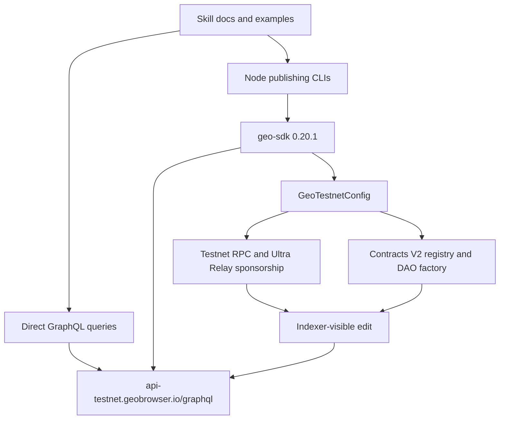

# Geo SDK 0.20.1, API, and Contracts V2 Migration - Plan

## Goal Capsule

- **Objective:** Move every testnet query, publishing flow, example, and verification path in this repository to the stable Geo SDK `0.20.1`, the current Geo API, and Contracts V2.
- **Authority:** User-settled migration choices come first, followed by the published `0.20.1` artifact and `GeoTestnetConfig`, the live testnet GraphQL schema, and repository conventions.
- **Execution profile:** Latest-only cutover with characterization and contract tests before live write verification.
- **Stop conditions:** Do not ship if the stable package cannot install from a frozen lockfile, a required export is absent, the sponsored testnet transaction fails, or the resulting edit does not index through the new API.
- **Tail ownership:** Implementation includes dependency and lockfile changes, scripts, skill documentation, deterministic verification, and testnet acceptance evidence.

---

## Product Contract

### Summary

The repository currently teaches and executes Geo SDK `0.18` patterns while the supported platform uses SDK `0.20.1`, a new API hostname, and Contracts V2.
The migration must leave one coherent testnet contract across `geo-query` and `geo-publish`, without deprecated runtime fallbacks or examples that compile but publish through obsolete infrastructure.

### Requirements

**Packaging and runtime**

- R1. `geo-publish` installs exact `@geoprotocol/geo-sdk@0.20.1`, declares every package it imports directly, and has a frozen lockfile that resolves the complete stable artifact.
- R2. Node 20 remains a supported runtime for both publishing CLIs, and CI installs and tests the nested `geo-publish` package rather than checking only the repository root.

**Query API**

- R3. Every direct testnet GraphQL request uses `https://api-testnet.geobrowser.io/graphql` with no fallback to the old hostname.
- R4. Query documentation uses the current schema's filter operators, connection shapes, entity fixtures, type IDs, and resolvable space labels.

**SDK publishing**

- R5. Publishing code uses v0.20 operation builders, configured clients, and the sponsored wallet client while avoiding deprecated `Graph`, `personalSpace`, `daoSpace`, and legacy wallet helpers.
- R6. `publish-entity` preserves its omitted-type fallback to `SystemIds.DEFAULT_TYPE` and accepts only aliases exported by SDK `0.20.1`.
- R7. Publishing guidance reflects current deletion, text-block, position, image, value-type, personal-space, and error semantics.

**Contracts V2**

- R8. Runtime code obtains the testnet chain, sponsorship route, and contract addresses from `GeoTestnetConfig` rather than duplicating configuration.
- R9. DAO examples and verification use space IDs, current voting settings, version-aware proposals and votes, explicit post-voting execution, and Contracts V2 result shapes.

**Verification**

- R10. Deterministic tests prevent legacy API, SDK, ID, filter, and value-type patterns from returning.
- R11. Read-only and write-enabled testnet smoke tests prove the API, sponsorship path, personal-space editing, indexing, deletion behavior, and an authorized DAO flow.

### Acceptance Examples

- AE1. **Default-type publish**
  - **Covers:** R5, R6, R8, R11
  - **Given:** A dedicated testnet signer with a personal space.
  - **When:** `publish-entity` publishes a uniquely named entity without `--type`.
  - **Then:** The sponsored transaction succeeds and the entity becomes queryable by both its ID and `SystemIds.DEFAULT_TYPE`.
- AE2. **Current query contract**
  - **Covers:** R3, R4, R10
  - **Given:** The repository's documented entity and type fixtures.
  - **When:** The read-only smoke suite executes the representative entity, connection, space, editor, and governance queries.
  - **Then:** The new host returns data using the documented fields and current filter grammar.
- AE3. **Contracts V2 DAO edit**
  - **Covers:** R8, R9, R11
  - **Given:** An authorized personal space and a designated test DAO.
  - **When:** An edit proposal, its required version-aware vote, and its post-voting execution are submitted using space IDs.
  - **Then:** Receipts succeed and the API exposes the proposal version, voting window, execution deadline and state, voting settings, and indexed edit.

### Scope Boundaries

- **Included:** Testnet query and publish skills, their CLIs and examples, dependency manifests, lockfiles, repository guidance, deterministic CI, and focused live acceptance tests.
- **Excluded:** Mainnet support, backward compatibility with SDK `0.18`, the old API hostname, unrelated feature work, and a general-purpose skill evaluation harness.
- **Deferred to follow-up work:** Supporting additional networks through custom `defineGeoNetworkConfig` values.

### Sources

- Published package metadata: `https://registry.npmjs.org/@geoprotocol/geo-sdk/0.20.1`
- Published package tarball: `https://registry.npmjs.org/@geoprotocol/geo-sdk/-/geo-sdk-0.20.1.tgz`
- SDK repository and v0.20 history: `https://github.com/geobrowser/geo-sdk` and `https://github.com/geobrowser/geo-sdk/blob/main/CHANGELOG.md`
- Current GraphQL endpoint: `https://api-testnet.geobrowser.io/graphql`
- `DEFAULT_TYPE` source at the inspected v0.20 commit: `https://github.com/geobrowser/geo-sdk/blob/f44bf44f36d838da5322a190aa868d7e5a86e46d/src/core/ids/system.ts#L259`

---

## Planning Contract

### Key Technical Decisions

- KTD1. **Use a latest-only contract.** `(session-settled: user-directed — chosen over dual compatibility: one supported SDK and API surface prevents examples and CLIs from diverging.)` All active code and guidance moves to v0.20; deprecated adapters may still exist in the dependency but are forbidden in this repository.
- KTD2. **Pin the complete stable release exactly.** Use `@geoprotocol/geo-sdk@0.20.1` rather than the superseded beta pin or a floating range. Registry inspection found 698 packaged files, compiled root and subpath JavaScript, declarations, and working root, ops, client, networks, contracts, and ABI imports.
- KTD3. **Preserve `DEFAULT_TYPE`.** `(session-settled: user-directed — chosen over requiring an explicit type: `DEFAULT_TYPE` remains exported by v0.20 and is part of the CLI's intended convenience.)` Live acceptance must prove indexing because export presence alone does not prove query behavior.
- KTD4. **Make `GeoTestnetConfig` the runtime authority.** Consumer code does not copy API origins, RPC URLs, sponsorship URLs, chain IDs, or contract addresses. Direct query documentation uses the canonical GraphQL URL because `geo-query` has no SDK dependency.
- KTD5. **Prefer pure operations and configured workflows.** Entity and relation edits use `Ops`; API, storage, deletion, personal-space, DAO-space, and image workflows use a configured Geo client.
- KTD6. **Verify the `0.20.1` sponsorship change with a real transaction.** The only production-code difference found between beta.10 and `0.20.1` is the built-in sponsorship URL changing from self-funded mode to the Ultra Relay provider, so successful import checks are insufficient release evidence.

### Public Interface Migration

| Legacy usage                                             | Required v0.20 usage                                                               |
| -------------------------------------------------------- | ---------------------------------------------------------------------------------- |
| `Graph.*`                                                | `Ops.entities.*`, `Ops.relations.*`, or the appropriate configured client workflow |
| `personalSpace.*`                                        | `geo.personalSpaces.*`                                                             |
| `daoSpace.*`                                             | `geo.daoSpaces.*`                                                                  |
| `getSmartAccountWalletClient`                            | `privateKeyToAccount` plus `createGeoWalletClient`                                 |
| `network: "TESTNET"`                                     | `network: GeoTestnetConfig`                                                        |
| Hardcoded publishing API, RPC, sponsorship, or contracts | `GeoTestnetConfig`                                                                 |
| `daoSpaceAddress`                                        | `daoSpaceId` or `spaceId` according to the v2 method                               |
| Treating a successful vote as execution                  | `executeProposal` after a passing `SLOW` vote ends and before `executeBy`          |
| Synchronous/global entity deletion                       | Awaited, space-scoped `geo.entities.delete` operations                             |
| `TextBlock.make` returning `{ ops, position }`           | `TextBlock.make` returning `Op[]`                                                  |
| `Position.default`, `after`, or `before`                 | `Position.generate` and `Position.generateBetween`                                 |
| Image helper with a network argument                     | `geo.images.create` on the configured client                                       |
| Value type `url`                                         | Value type `text` for URL properties                                               |

### High-Level Technical Design

### Sequencing and Risks

- Land dependency and verification foundations before changing examples so subsequent units compile against the exact target artifact.
- Query and publishing migrations can proceed after the dependency unit, but documentation consolidation waits for both to establish canonical patterns.
- Live reads are an external-service smoke and must not make deterministic PR checks flaky.
- Live writes require dedicated testnet credentials and an authorized DAO; tests must skip clearly when those inputs are absent and never log secrets.
- Package import success does not prove sponsorship, contract routing, or indexing, so U5 remains a release requirement.

---

## Implementation Units

### U1. Stable package and verification foundation

- **Goal:** Establish SDK `0.20.1` and make package drift visible in CI.
- **Requirements:** R1, R2, R10; KTD2.
- **Dependencies:** None.
- **Files:** `geo-publish/package.json`, `geo-publish/bun.lock`, `geo-publish/SKILL.md`, `geo-publish/reference.md`, `geo-publish/examples/`, `package.json`, `.github/workflows/format.yml`, `tests/repo-migration-contract.test.mjs`.
- **Approach:** Pin `@geoprotocol/geo-sdk` to `0.20.1`, add direct `viem` because the CLIs import it, replace only the mechanical `Op` imports across publishing guidance and examples, and then remove direct `@geoprotocol/grc-20`. U4 owns all remaining semantic example changes. Add root scripts that run deterministic tests across both packages, and extend CI with a frozen nested install plus Node 20 package-export and CLI-import checks.
- **Execution note:** Start with install and export characterization so later failures distinguish package problems from migration mistakes.
- **Test scenarios:**
  1. A frozen root and nested install resolves exact SDK `0.20.1` without changing either lockfile.
  2. Node 20 imports the SDK root plus `ops`, `client`, `networks`, `contracts`, and `abis` subpaths and finds every migration-required export.
  3. The nested manifest declares `viem` directly and has no direct `@geoprotocol/grc-20` dependency.
  4. The repository drift test reports each forbidden legacy token with its file path and exits successfully when none exist.
- **Verification:** CI installs both package roots, exercises the published export surface, runs deterministic tests, and preserves the existing format check.

### U2. Current GraphQL query contract

- **Goal:** Make `geo-query` accurate against the new endpoint and live schema.
- **Requirements:** R3, R4, R10, R11; KTD4.
- **Dependencies:** U1.
- **Files:** `geo-query/SKILL.md`, `geo-query/reference.md`, `geo-query/examples/`, `tests/api-contract-smoke.mjs`.
- **Approach:** Replace the old host, update filter grammar and cursor examples, refresh fixtures, and remove named space entries that no longer resolve to topics. Use Person `7ed45f2bc48b419e8e4664d5ff680b0d`, Project `484a18c5030a499cb0f2ef588ff16d50`, News story `e550fe517e904b2c8fffdf13408f5634`, and Geo entity `6b9f649e38b64224927dd66171343730` as the rich lookup fixture. Use `is`, `isNot`, `in`, and `notIn` for scalar filters and the schema-supported UUID-list operators such as `containedBy`, `overlaps`, and `anyEqualTo`.
- **Test scenarios:**
  1. The new endpoint returns the Geo fixture with non-empty name, values, relations, and space context.
  2. A Person type query returns current entities while the retired Person ID is absent from documentation.
  3. Flat entity queries and `entitiesConnection` examples return their documented shapes and usable `pageInfo`.
  4. Space and editor lookups return the labels claimed by the skill.
  5. Proposal-version, current-proposal, and voting-setting fields used by publishing examples exist in the live schema.
  6. HTTP, JSON, GraphQL-error, and missing-data failures produce a nonzero smoke result with a useful message.
- **Verification:** Every documented query is syntactically valid against the live schema, and the read-only smoke suite passes on demand without credentials.

### U3. Configured publishing CLIs

- **Goal:** Move executable publishing paths to the stable client, operation, signer, and wallet interfaces.
- **Requirements:** R5, R6, R8, R10; KTD1, KTD3, KTD4, KTD5.
- **Dependencies:** U1.
- **Files:** `geo-publish/bin/runtime.mjs`, `geo-publish/bin/whoami.mjs`, `geo-publish/bin/publish-entity.mjs`, `geo-publish/test/runtime.test.mjs`, `geo-publish/test/cli.test.mjs`.
- **Approach:** Extract a small shared runtime for private-key normalization, signer construction, configured client creation, and GraphQL envelope handling. Derive identity from the signer address, create the sponsored wallet only for writes, build entity operations through `Ops`, and publish through `geo.personalSpaces`. Keep default, person, company, project, role, article, topic, and skill aliases; reject removed aliases with the valid list.
- **Test scenarios:**
  1. A valid prefixed or unprefixed private key creates the expected signer without exposing the key in output.
  2. Missing or malformed credentials fail before any API or wallet call.
  3. `whoami` reports the signer address, personal space, and editable spaces from successful mocked API data.
  4. HTTP failures, GraphQL `errors`, missing `data`, and absent personal spaces produce distinct actionable failures.
  5. Publishing without `--type` builds a type relation to `SystemIds.DEFAULT_TYPE`.
  6. Every retained alias resolves to the SDK export, while every removed alias fails before a transaction is sent.
  7. A write path passes `GeoTestnetConfig` to both Geo and wallet clients and submits the returned destination and calldata.
- **Verification:** Both CLIs pass Node 20 tests, have no legacy imports or network strings, and preserve their documented command-line behavior except for removed aliases.

### U4. Publishing semantics and guidance

- **Goal:** Make all publishing instructions executable and semantically correct for SDK `0.20.1` and Contracts V2.
- **Requirements:** R5, R7, R8, R9, R10; KTD1, KTD4, KTD5.
- **Dependencies:** U2, U3.
- **Files:** `geo-publish/SKILL.md`, `geo-publish/reference.md`, `geo-publish/examples/`, `README.md`, `CONTRIBUTING.md`, `tests/repo-migration-contract.test.mjs`.
- **Approach:** Replace deprecated examples with the canonical patterns established in U3. Describe deletion as asynchronous and space-scoped, handle empty deletion operations as a no-op, and remove global/backlink deletion claims. Update text blocks, positions, images, decimal and timezone-bearing values, and URL-as-text examples. Use only exported v0.20 IDs; use `SystemIds.WORKS_AT_PROPERTY` for employment and discovery-provided placeholders where no canonical property constant exists. Rewrite DAO guidance around space IDs, per-space voting settings, proposal versions, and current API governance fields.
- **Test scenarios:**
  1. Static verification finds no old host, deprecated namespaces, legacy wallet helper, string network, `daoSpaceAddress`, removed constants, stale filter operators, or `type: "url"`.
  2. Every operation-building example returns or accumulates `Op[]` without destructuring the obsolete text-block result.
  3. Decimal examples use exponent and mantissa, while time and datetime examples include a timezone.
  4. Deletion guidance includes `spaceId`, awaits current graph context, and avoids publishing an empty operation list.
  5. DAO examples query current voting settings, carry version identifiers where the v2 flow requires them, and explicitly execute passing `SLOW` proposals within their execution window.
- **Verification:** A contributor can follow one personal-space example and one DAO-space example without encountering an absent export, obsolete parameter, or contradicted API field.

### U5. Testnet sponsorship, contracts, and indexing acceptance

- **Goal:** Prove the migrated paths work through the infrastructure configured by stable `0.20.1`.
- **Requirements:** R8, R9, R11; AE1, AE3; KTD3, KTD4, KTD6.
- **Dependencies:** U2, U3, U4.
- **Files:** `geo-publish/test/live-testnet.test.mjs`, `geo-publish/package.json`, `geo-publish/reference.md`.
- **Approach:** Add environment-gated live tests that are excluded from deterministic CI. Use a dedicated funded or sponsored testnet signer and designated DAO, exercise the production `publish-entity` path for the default-type personal edit, submit the remaining real transactions through `createGeoWalletClient`, and poll the new API every five seconds for up to two minutes. After a passing `SLOW` vote reaches `endTime`, execute the proposal before `executeBy`. Assert configured chain and contract behavior through receipts, known space mappings, proposals, execution state, and indexed edits rather than merely checking deployed bytecode.
- **Test scenarios:**
  1. `GeoTestnetConfig` reports chain ID `55516`, the new API origin, sponsorship configuration, and the required registry and DAO factory addresses.
  2. A sponsored EIP-7702 personal-space edit succeeds through the `0.20.1` Ultra Relay route.
  3. The no-type entity from AE1 appears by ID and through `SystemIds.DEFAULT_TYPE` before the polling deadline.
  4. Space-scoped deletion returns operations for the test entity, publishes them successfully, and treats a repeat deletion as an empty no-op.
  5. The authorized DAO flow from AE3 proposes, votes, and executes successfully without a DAO contract address supplied by the caller.
  6. Missing live-test credentials skip with a clear reason, while invalid authorization or sponsorship fails rather than being misreported as a skip.
- **Verification:** Store transaction, entity, edit, proposal, and version identifiers in the acceptance output, with no private key or secret-bearing URL logged.

---

## Verification Contract

| Gate                                        | Applies to   | Passing signal                                                                                          |
| ------------------------------------------- | ------------ | ------------------------------------------------------------------------------------------------------- |
| Root frozen install and `bun run fmt:check` | Every change | Root lockfile is unchanged and formatting passes.                                                       |
| Frozen install in `geo-publish/`            | U1-U5        | Exact SDK `0.20.1` installs from the committed lockfile.                                                |
| Root migration-contract test                | U1, U2, U4   | No forbidden endpoint, API, constant, ID, filter, or typed-value pattern remains.                       |
| Node 20 runtime and CLI tests               | U1, U3       | Package exports, runtime helpers, and CLI success and failure paths pass.                               |
| Read-only API smoke                         | U2, U4       | Representative queries pass against the new GraphQL endpoint.                                           |
| Environment-gated live write test           | U5           | Sponsored personal and authorized DAO transactions succeed and their effects index before the deadline. |

Live API availability is not a deterministic PR gate.
The live write test is a release gate and must be run with testnet-only credentials before merging or publishing updated skill guidance.

---

## Definition of Done

- All R1-R11 requirements and AE1-AE3 acceptance examples are satisfied.
- `geo-publish` resolves exact SDK `0.20.1`; the beta pin and corrected-stable release blocker are removed.
- No active code, documentation, or example references the old API hostname or a forbidden v0.18 compatibility pattern.
- Deterministic installs, formatting, migration-contract checks, Node 20 tests, and read-only API smoke pass.
- A real sponsored personal-space publish verifies the `0.20.1` Ultra Relay configuration and indexes through `DEFAULT_TYPE`.
- A designated Contracts V2 DAO proposal, vote, and execution succeed and are visible through current governance fields.
- No secrets, temporary diagnostics, abandoned migration adapters, or dead-end experimental code remain in the repository diff.
- Rollback is a coordinated revert of dependency, lockfile, code, documentation, and tests; the old host and SDK are not runtime fallback mechanisms.
